<!-- 1. GitHub usernameを変更 -->

  

  ・portfolio

  [https://k22036.github.io/portfolio/](https://k22036.github.io/portfolio/)

<!-- 4. GitHub usernameを変更, 2箇所 -->
<!-- ライトモート：theme=light, ダークモート：theme=vue-dark  -->
## 🏃‍♀️ Activities

 
  
  

<!--
This repository is a ✨ _special_ ✨ repository because its `README.md` (this file) appears on your GitHub profile.

Here are some ideas to get you started:

- 🔭 I’m currently working on ...
- 🌱 I’m currently learning ...
- 👯 I’m looking to collaborate on ...
- 🤔 I’m looking for help with ...
- 💬 Ask me about ...
- 📫 How to reach me: ...
- 😄 Pronouns: ...
- ⚡ Fun fact: ...
-->

